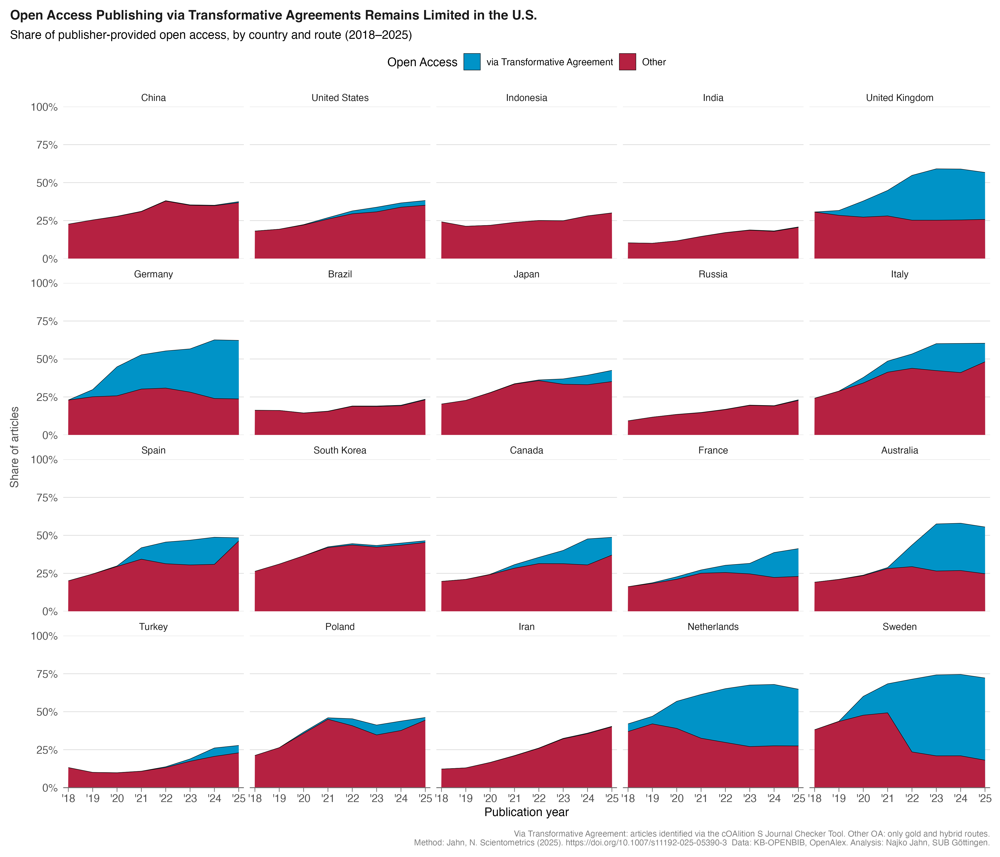

## About

This notebook documents steps taken to obtain the publication volume and corresponding market share from commercial publishers using open metadata.
The work is carried out using Google BigQuery.

```{r}
#| label: setup
#| message: false
library(tidyverse)

# use theme
my_theme <- function(base_size = 12) {
  theme_minimal(base_size = base_size) +
    theme(
      # Remove all grid lines except horizontal major
      panel.grid.major.x = element_blank(),
      panel.grid.minor.x = element_blank(),
      panel.grid.minor.y = element_blank(),
      panel.grid.major.y = element_line(color = "grey85", linewidth = 0.3),
      # Clean axis styling
      axis.line.x = element_line(color = "grey40", linewidth = 0.4),
      axis.ticks.x = element_line(color = "grey40", linewidth = 0.3),
      axis.ticks.length.x = unit(0.15, "cm"),
      axis.ticks.y = element_blank(),
      # Typography
      axis.text = element_text(color = "grey30", size = rel(0.9)),
      axis.title.y = element_text(color = "grey30", size = rel(0.95), margin = margin(r = 10)),
      plot.title = element_text(face = "bold", size = rel(1.1), color = "grey10", margin = margin(b = 8)),
      plot.title.position = "plot",
      plot.caption = element_text(hjust = 1, size = rel(0.7), color = "grey50", margin = margin(t = 12)),
      plot.caption.position = "plot",
      # Legend
      legend.position = "top",
      # Margins
      plot.margin = margin(10, 10, 10, 10)
    )
}
```


```{r}
country_df <- readr::read_csv("data/total_by_country_oa.csv")

top_50_countries <- country_df |>
  filter(!is.na(country_code)) |>
  group_by(country_code) |>
  summarise(across(starts_with("n_"), \(x) sum(x, na.rm = TRUE))) |>
  mutate(total = rowSums(across(starts_with("n_")), na.rm = TRUE)) |>
  slice_max(total, n = 50) |>
  arrange(desc(total)) |>
  pull(country_code)


country_all <- country_df |>
  filter(!is.na(country_code)) |>
  mutate(country_code = if_else(country_code %in% top_50_countries, country_code, "Other")) |>
  group_by(publication_year, country_code) |>
  summarise(across(starts_with("n_"), \(x) sum(x, na.rm = FALSE)), .groups = "drop") |>
  mutate(country_code = factor(country_code, levels = c(top_50_countries, "Other"))) |>
  arrange(desc(publication_year), country_code)
```


Plot

```{r}
# plot the top 20
top_20_countries <- top_50_countries[1:20]
library(countrycode)

my_plot <- country_all |>
  filter(country_code %in% top_20_countries) |>
  mutate(
    oa_in_the_wild = (n_oa_articles - n_ta_articles) / n_articles,
    n_ta_articles  = n_ta_articles / n_articles,
    country_name   = factor(
      countrycode(country_code, origin = "iso2c", destination = "country.name"),
      levels = countrycode(top_20_countries, origin = "iso2c", destination = "country.name")
    )
  ) |>
  pivot_longer(cols = c(oa_in_the_wild, n_ta_articles)) |>
  mutate(publication_year = factor(gsub("^20", "'", as.character(publication_year)))) |>
  ggplot(aes(publication_year, value, fill = name, group = name)) +
  geom_area(position = "stack", color = "black", linewidth = 0.2) +
  scale_y_continuous(
    labels = scales::percent,
    limits = c(0, 1),
    expand = c(0, 0)
  ) +
  scale_x_discrete(expand = c(0.03, 0)) +
  scale_fill_manual(
    "Open Access",
    values = c(
      `oa_in_the_wild` = "#B52141",
      `n_ta_articles`  = "#0093c7"
    ),
    labels = c(
      `oa_in_the_wild` = "Other",
      `n_ta_articles`  = "via Transformative Agreement"
    )
  ) + facet_wrap(~ country_name, ncol = 5) +
  labs(
  title    = "Open Access Publishing via Transformative Agreements Remains Limited in the U.S.",
  subtitle = "Share of publisher-provided open access, by country and route (2018–2025)",
  caption  = paste0(
    "Via Transformative Agreement: articles identified via the cOAlition S Journal Checker Tool. ",
    "Other OA: only gold and hybrid routes.\n",
    "Method: Jahn, N. Scientometrics (2025). https://doi.org/10.1007/s11192-025-05390-3  ",
    "Data: KB-OPENBIB, OpenAlex. Analysis: Najko Jahn, SUB Göttingen."
  ),
  x = "Publication year",
  y = "Share of articles"
) +
   my_theme() 
```


```{r}
ggsave(
  "plots/oa_by_country.png",
  plot = my_plot,
  width = 14,
  height = 12,
  dpi = 300,
  bg = "white"
)
```



```{r}
country_all |>
  filter(country_code %in% top_20_countries) |>
  mutate(
    prop_other_oa = (n_oa_articles - n_ta_articles) / n_articles,
    prop_ta_articles  = n_ta_articles / n_articles,
    country_name   = factor(
      countrycode(country_code, origin = "iso2c", destination = "country.name"),
      levels = countrycode(top_20_countries, origin = "iso2c", destination = "country.name")
    )
  ) |> 
  write_csv("data/country_oa_shares.csv")
```

