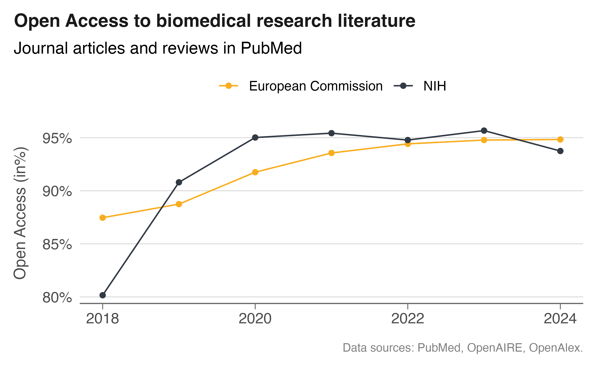
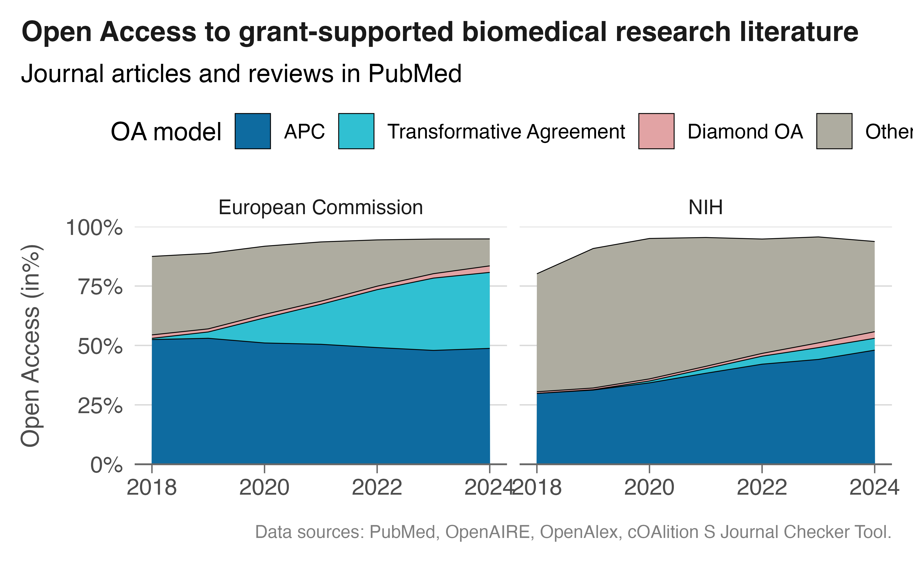

# OA by funder

## Aim

The aim of this notebook is to demonstrate how to create a crosswalk of
different Google BigQuery datasets that can be discovered through
ORION-DBs. It would be interesting to track the development of open
access over the years by country and funder. Of particular interest is
comparing the US with European countries, since the NIH’s recent
proposals for supporting open access financially suggest similar funding
approaches, with transformative agreements playing an increasing role in
accommodating those costs and potential price caps.

## Overview of data sources used

In this notebook, we use the following sources to create a unified
dataset on open access uptake across countries and funders, focusing
particularly on publisher-provided open access through transformative
agreements.

The data sources to be cross-walked are:

- **PubMed**: We use PubMed to retrieve NIH grant-supported publications
  and as an idication for biomedical literature.
- **Open access evidence**: OpenAlex provides article- and journal-level
  open access information. We use the February 2026 OpenAlex snapshot
  provided by SUB Göttingen.
- **Publisher metadata**: Crossref is used for publisher disambiguation,
  as it provides more coherent publisher names without imprints compared
  to OpenAlex.
- **Document classification**: A document classification dataset
  provided by SUB Göttingen is used to restrict the sample to original
  research articles.
- **Articles under transformative agreements**: SUB Göttingen provides a
  dataset about journals, institutions, and articles that are enabled by
  transformative agreements.
- **Grant-supported publications**: We use the OpenAIRE graph, provided
  by Sesame Open Science, to obtain grant-supported publications from
  the NIH and the European Commission.

When conducting open access analysis, it is important to relate it to a
meaningful overall sample. In this tutorial, we will focus on articles
representing original research, according to a document classification
approach, as they are often invoiced to institutions, and on articles
which are indexed in PubMed, to restrict ourselves to life sciences
literature. The latter can be inferred from both OpenAlex and OpenAIRE.

For country analysis, we use the first author’s country affiliation from
OpenAlex.

## Data gathering steps

### 1. Create publication metadata set

Initially, it is often helpful to start with a subset of publications
and select only the columns needed for your analysis. This saves on
query costs, keeps the dataset manageable, and safeguards the raw
metadata in case an ORION provider updates their data.

The first step is to create a publication dataset enriched with grant
funding information from the NIH and the European Commission.

NIH Funding data are retrieved from PubMed. Here, the API is used and a
list of PMIDS, a databse identifier, is retrieved and then imported into
BigQuery.

European Commission funding data are obtained from the OpenAIRE graph,
as provided by Sesame Open Science, and linked to publication metadata
from OpenAlex and Crossref.

The query makes use of temporary tables introduced with `WITH`, also
known as Common Table Expressions (CTEs). The first CTE extracts funded
publications from OpenAIRE by unnesting the fundings array and filtering
for the two funders of interest, then joining to the OpenAIRE
publication and relation tables to retrieve the associated DOIs. This is
then joined to the main publication dataset.

In the main query, we select metadata about all articles in the OpenAlex
snapshot and apply a number of filters to restrict the dataset to
relevant publications. The focus is on original research articles and
reviews, using first author affiliations only. Note that in the OpenAlex
snapshot used here, the author position field was not exported by
OpenAlex, so first authors are identified using the `WITH OFFSET`
position. Crossref is used as the source for publisher metadata, as it
provides more coherent publisher disambiguation without imprints
compared to OpenAlex. The dataset is restricted to publications from
2018 to 2025.

To query BigQuery through our Quarto notebook, we use the R `bigrquery`
DBI interface. To connect:

In the first step, we uplaod list of PMIDs to BigUqery, repreentign
publicaitons associated with NIH fuinding according to PubMed.

In total, PubMed indexed 824060 publications between 2018 and 2024 with
NIH grant support.

Next, we bing it toegtehr with OpenAire, adding biomeldcial literature
grant-supported by the European Commisison, and OpenAlex and Crossref to
obtain schoalrly matedata about these publicaitons.

We save the table in our resource datasets for misc datasets
`subugoe-collaborative.resources.oa_tutorial_md_raw`. You will need to
define your own dataset.

### 2. Estimate articles from transformative agreements

Next, we will estimate open access articles covered by a transformative
agreement using a method described in @Jahn_2025

The following query uses several datasets from the Journal Checker tool,
provided by SUB Göttingen in the OpenBib collection.

With these two datasets compiled, we are ready to proceed with the open
access analysis.

### Create analytical dataset: Funder view

Her eis the table, which Is tored in an R object `funding_oa`for further
local data analysis.

    #> # A tibble: 108 × 6
    #>    publication_year funders            articles n_oa_articles oa_type enabled_ta
    #>               <int> <chr>                 <int>         <int> <chr>   <lgl>     
    #>  1             2024 European Commissi…    26952          3036 other_… FALSE     
    #>  2             2024 European Commissi…    26952          1393 <NA>    FALSE     
    #>  3             2024 European Commissi…    26952          2117 gold_i… TRUE      
    #>  4             2024 European Commissi…    26952          9531 gold_i… FALSE     
    #>  5             2024 European Commissi…    26952          6503 hybrid… TRUE      
    #>  6             2024 European Commissi…    26952          3610 hybrid… FALSE     
    #>  7             2024 European Commissi…    26952           740 diamon… FALSE     
    #>  8             2024 European Commissi…    26952            22 other_… TRUE      
    #>  9             2024 NIH                   89770         33969 other_… FALSE     
    #> 10             2024 NIH                   89770          5615 <NA>    FALSE     
    #> # ℹ 98 more rows

Open access by open access business model. we distinguish between

APC: gold and hybrid not via TA TA: gold and hybrid via TA Diamond:
diamond Other

    #> # A tibble: 56 × 6
    #>    publication_year funders             articles oa_cat             n_oa oa_prop
    #>               <int> <chr>                  <int> <fct>             <int>   <dbl>
    #>  1             2024 European Commission    26952 Other              3058  0.113 
    #>  2             2024 European Commission    26952 Transformative A…  8620  0.320 
    #>  3             2024 European Commission    26952 APC               13141  0.488 
    #>  4             2024 European Commission    26952 Diamond OA          740  0.0275
    #>  5             2024 NIH                    89770 Other             34073  0.380 
    #>  6             2024 NIH                    89770 Diamond OA         2493  0.0278
    #>  7             2024 NIH                    89770 APC               43103  0.480 
    #>  8             2024 NIH                    89770 Transformative A…  4486  0.0500
    #>  9             2023 NIH                    97390 Other             43412  0.446 
    #> 10             2023 NIH                    97390 APC               42967  0.441 
    #> # ℹ 46 more rows

